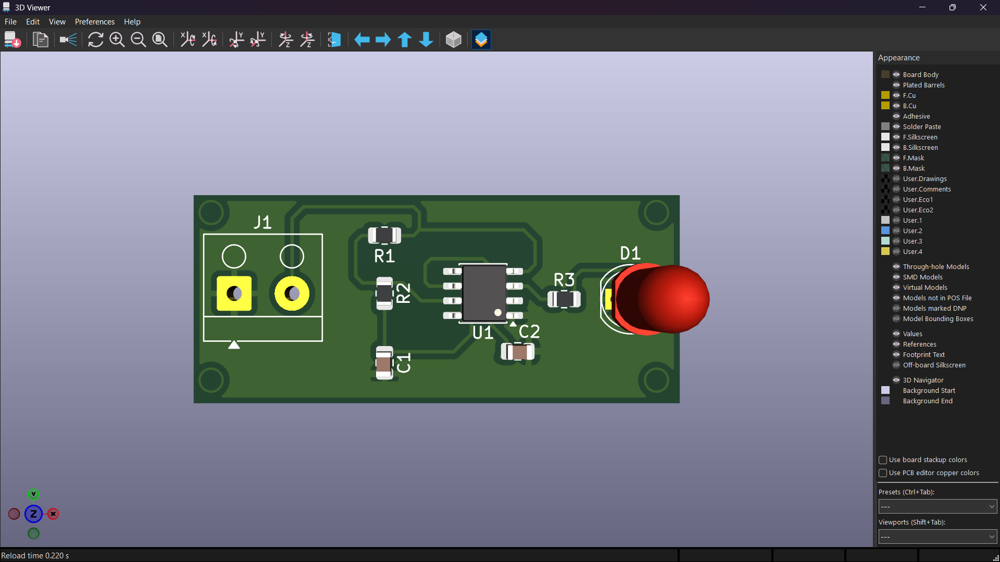

# 555 Timer LED Blinker PCB

A 555 Timer based LED Blinker PCB designed using KiCad.

## Project Overview

This project is a simple LED blinker circuit using the NE555 timer IC in astable mode.

The complete PCB design workflow was performed using KiCad, including:

- Circuit schematic design
- Footprint assignment
- PCB component placement
- PCB routing
- Design Rule Check (DRC)
- 3D PCB verification
- Gerber file generation
- Drill file generation

## Components

| Reference | Component | Value |
|----------|-----------|-------|
| U1 | NE555 Timer IC | NE555D |
| R1 | Resistor | 1kΩ |
| R2 | Resistor | 10kΩ |
| R3 | Resistor | 330Ω |
| C1 | Capacitor | 10µF |
| C2 | Capacitor | 100nF |
| D1 | LED | LED |
| J1 | Screw Terminal | 2-Pin |

## Circuit

The NE555 timer is configured in astable mode to generate a continuous square-wave output.

The output of the 555 timer drives the LED through a 330Ω current-limiting resistor.

## Design Workflow

1. Schematic Design
2. Assign PCB Footprints
3. PCB Component Placement
4. PCB Routing
5. Design Rule Check
6. 3D PCB Verification
7. Gerber Generation
8. Drill File Generation

## PCB Design

The PCB was designed and routed using KiCad.

The board includes:

- 2-pin power input
- NE555 timer IC
- Timing resistor network
- Timing capacitors
- LED indicator
- Current limiting resistor
- Four mounting holes

## 3D PCB View

## Design Verification

- Schematic completed
- PCB layout completed
- PCB routing completed
- DRC completed successfully
- DRC Violations: 0
- Unconnected Items: 0
- 3D PCB model verified

## Gerber Files

Gerber files required for PCB fabrication are included in this repository.

Included fabrication files:

- Front Copper
- Back Copper
- Front Solder Mask
- Back Solder Mask
- Front Silkscreen
- Back Silkscreen
- Edge Cuts
- Drill Files

## Project Files

### KiCad Files

- `p2.kicad_sch` — Schematic
- `p2.kicad_pcb` — PCB Layout
- `p2.kicad_pro` — KiCad Project

### Manufacturing Files

- `p2-F_Cu.gbr`
- `p2-B_Cu.gbr`
- `p2-F_Mask.gbr`
- `p2-B_Mask.gbr`
- `p2-F_Silkscreen.gbr`
- `p2-B_Silkscreen.gbr`
- `p2-Edge_Cuts.gbr`
- `p2-PTH.drl`
- `p2-NPTH.drl`

## Tools Used

- KiCad
- PCB Editor
- Schematic Editor
- 3D Viewer
- Design Rules Checker
- Gerber Viewer

## Learning Outcomes

Through this project, I learned and practiced:

- PCB schematic creation
- Electronic component selection
- Footprint assignment
- PCB layout design
- Component placement
- PCB trace routing
- Ground plane / copper zone
- Design Rule Checking
- Gerber generation
- Drill file generation
- 3D PCB visualization

## Project Status

**Completed**

Schematic → PCB Layout → Routing → DRC → 3D Verification → Gerber Generation

## Author

**Vishal Bodkhe**

Electronics & Computer Engineering

## License

This project is created for educational and portfolio purposes.
